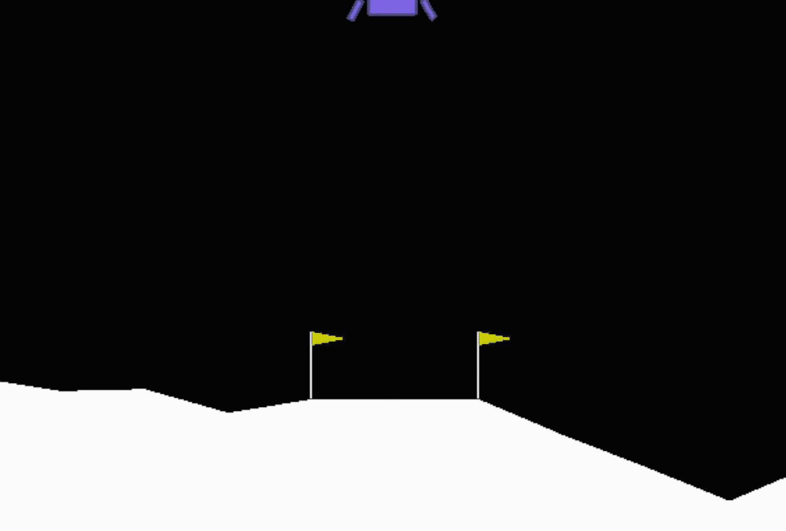
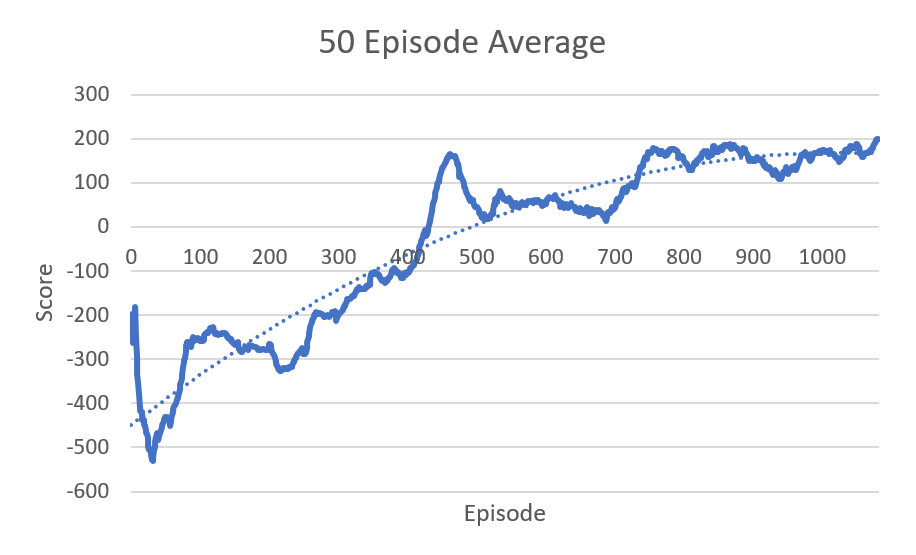

Completes the Lunar lander environment by Open AI, using a reinforcement Double Deep Q-learning Network.

### Installation
Create a python virtual environment and run the following command to install the required packages 
```
pip install requirements.txt
```
* The Lunar Lander module from Open AI gym's module requires some additional libraries to function properly, on Windows the current described version of Box2D works well, but for other platforms different libraries may need to be used. If the above fails to install correctly please refer to  [here](https://www.gymlibrary.dev/environments/box2d/) for how to install on your particular platform.

### Training Script
To run train the model the following command can be run, alternate arguments are available and can be found in the train script, but the best performing hyper-parameters have been set as defaults.
```
python3 train.py --episodes 2000 --val True --early_stop 200
```
The following is the 50-episode average the model was achieving during training. The --early_stop argument uses this average to determine when the model has successfully learned how ot navigate the environment.



### Validation Script
The following script can be used to validate the model, note that this process is automatically done during training if configured to do so, but if a consistent visual output is desired use this script.
```
python3 validate.py --episodes 100 --checkpoint "SavedModels/LunarLanderModel.pt"
```

